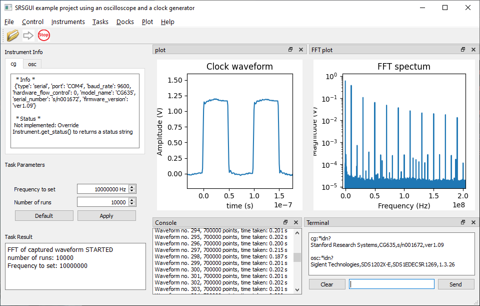

# ``Srsgui`` - Organize instrument-controlling Python scripts as a GUI application

`Srsgui` is a simple platform:

   - To define instrument classes for instruments that use remote communication,
     based on `Instrument` class and the communication `Interface` class 
     (By default, serial, TCPIP is available, extendable to VXI11, GPIB and USB-TMC).

   - To write Python scripts (tasks) that run in GUI environment with simple APIs
     provided in ``Task`` class.

   - To organize instrument classes and task scripts presented in a GUI application
     using a configuration (.taskconfig) file for a project

## Installation

To run ``srsgui`` as an application, create a virtual environment, if necessary, 
and install using ``pip`` with [full] option:  

    python -m pip install srsgui[full]

if it fails, you have to install 
[pyserial](https://pypi.org/project/pyserial/), 
[matplotlib](https://pypi.org/project/matplotlib/) and 
a Python Qt binder ([PySide6](https://pypi.org/project/PySide6/),
[PySide2](https://pypi.org/project/PySide2/) or 
[PyQt5](https://pypi.org/project/PyQt5/)) manually.
``srsgui`` package has these 3 dependencies only.

Some Linux distributions offer some of the Python packages from their 
repositories only, not from ``pip``. Run web search for more information on 
system specific installation.   

When matplotlib and one of the Qt binders
are installed properly, install ``srsgui`` without [full] option:

    python -m pip install srsgui

## Start ``srsgui`` application
    
if the Python Script directory is in PATH environment variable,
Start the application by typing from the command line:

    srsgui
    

If the script directory is not in PATH,

    python -m srsgui
    
It will start `srsgui` application.

## Run the example project

By default, `srsgui` application starts with the last project it ran,
when it is closed.
 
To open the example project included in the `srsgui` package,
, if it does not start with the example project, go to the `srsgui` package 
directory, find the examples directory, and find a .taskconfig file in an 
example project folder. 

You can run the second and fifth task in the Task menu 
even without any instruments connected.

## Create a project

`Srsgui` is a platform that helps you to write your own instrument-controlling 
Python scripts running as a GUI application. Using its APIs, you can write 

scripts running in GUI with the same amount of code with writing console-based 
scripts.
